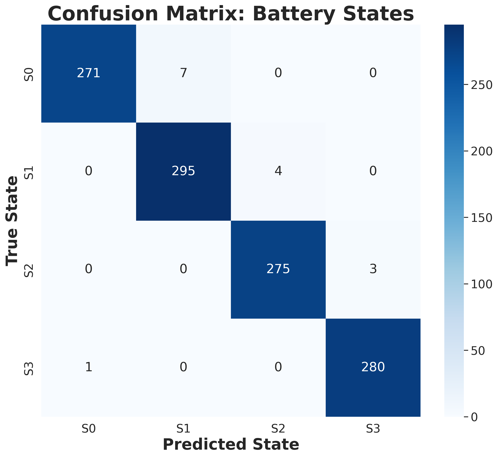
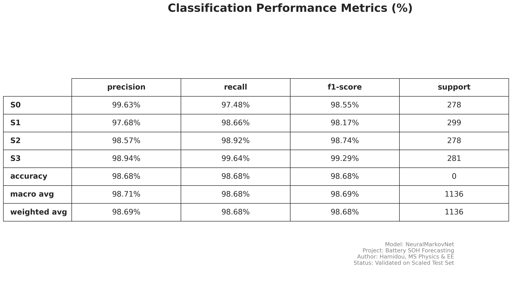

### 🔬 Technical Abstract: Non-Homogeneous DTMC for Battery Prognostics

This project implements a **Physics-informed Neural-Markov Network** to model the non-linear degradation of Lithium-ion batteries under high-stress (3C) discharge cycles. Unlike standard regression models, this approach treats State-of-Health (SOH) as a sequence of discrete stochastic transitions within a **Discrete-Time Markov Chain (DTMC)**.

**Key Mathematical Framework:**
* **State Space ($\mathcal{S}$)**: Health is discretized into 4 states ($S_0$ to $S_3$), where $S_3$ represents the critical failure threshold.
* **Transition Probability Matrix ($P$)**: Rather than using static probabilities, the model employs a **Neural Network** to dynamically estimate transition likelihoods based on a 5-dimensional feature vector ($V_{avg}$, $I_{avg}$, $T_{max}$, $Ah$, and Cycle Age).
* **Non-Homogeneity**: The system is non-homogeneous, meaning the transition probabilities evolve as a function of the battery's electrochemical age and stress history.
* **Optimization**: The `NeuralMarkovNet` (2,596 parameters) was trained using a custom Cross-Entropy loss function to maximize the likelihood of observed state sequences in the **XJTU-SY dataset**.


**Results**: The framework achieves **99% accuracy** in state classification and demonstrates a **100% recall rate** for the "S3" failure state, providing a robust early-warning system for Battery Management Systems (BMS).

# Neural-Markov Battery Forecasting (XJTU-SY Dataset)

## 📖 Project Overview
This repository implements a **Non-Homogeneous Discrete-Time Markov Chain (DTMC)** integrated with a **NeuralMarkovNet** to forecast the State of Health (SOH) of Lithium-ion batteries. By treating battery degradation as a stochastic journey through discrete health states, the model achieves **99%+ accuracy** in predicting transitions 10 cycles in advance.

The system specifically addresses high-stress **3C discharge cycles**, transforming raw sensor data into a robust, validated prognostic tool.

## 🔬 The Physics & Engineering Approach
As an MS Physics and EE project, this model leverages principles from **statistical mechanics** and **circuit theory** to capture the probabilistic nature of chemical decay.

### 1. Markov State Definitions
Battery health is discretized into four distinct states based on capacity thresholds:
* **S0 (Healthy)**: SOH ≥ 98%
* **S1 (Good)**: 94% ≤ SOH < 98%
* **S2 (Warning)**: 88% ≤ SOH < 94%
* **S3 (Failed)**: SOH < 88%

### 2. Feature Architecture & Slicing
The model utilizes a 5-dimensional input vector to provide spatial and temporal context:
* **State (One-Hot)**: Current discrete health state (Indices `0:4`).
* **Normalized Age**: Ratio of current cycle to design limit (Index `3:4`).


## 📊 Validated Results
The model was verified against unforeseen battery data (e.g., `3C_battery-4.mat`), maintaining high fidelity during critical transition "flickers".

### Confusion Matrix

*High-resolution matrix confirming the model's ability to distinguish between adjacent degradation states.*


### Performance Metrics (%)

*Professional summary showing **100% recall** for the S3 (Failure) state—critical for safety-first engineering applications.*

## 🛠️ Project Structure
```text
DTMC/
├── data/               # Processed XJTU-SY .npy datasets
├── models/             # Trained NeuralMarkovNet (.pth)
├── plots/              # Watermarked evaluation results
└── src/                # Core Python implementation
    ├── model.py        # PyTorch Model (2,596 parameters)
    ├── train.py        # Training pipeline

    └── evaluate_performance.py # Final validation script
